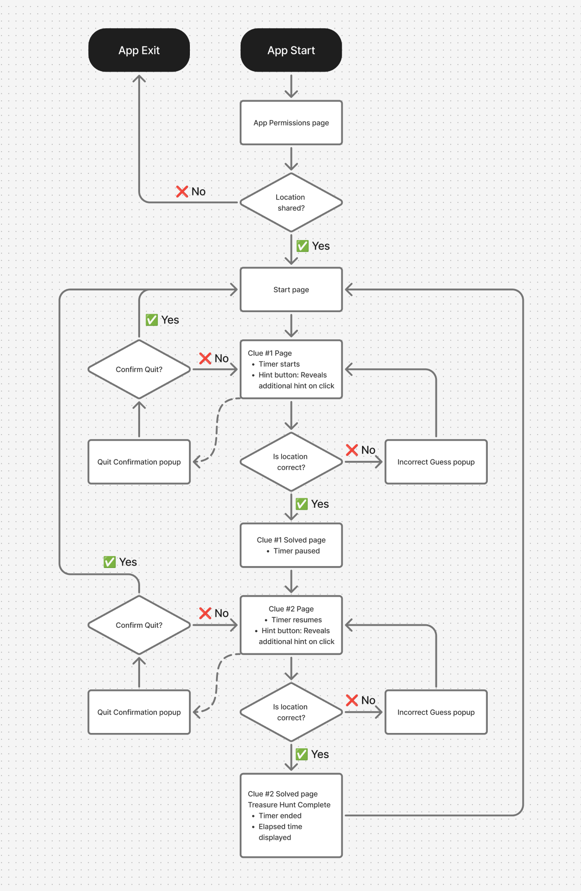
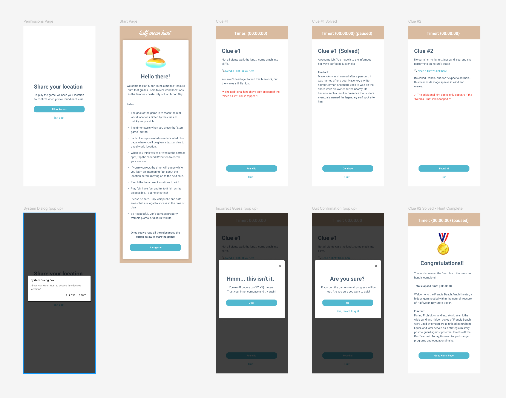

# Half Moon Hunt: Mobile Treasure Hunt

An **Android app built with Kotlin and Jetpack Compose** that guides users through a real world treasure hunt in **Half Moon Bay, California**. Players follow location based clues and use **GPS** to verify when they’ve reached each destination, unlocking virtual "treasure" along the way.

---

## Features

- **Location-based gameplay:** Uses GPS to confirm when the player reaches a target location  
- **Sequential clues:** Each new clue unlocks after the previous location is found  
- **Permissions handling:** Built-in location permission requests  
- **Compose UI:** Simple user interface with clear feedback for progress and completion  
- **State management:** ViewModel and StateFlow maintain game progress and location updates  

---

## Architecture

| Component | Description |
|------------|--------------|
| **Language** | Kotlin |
| **UI Framework** | Jetpack Compose |
| **Architecture Pattern** | MVVM |
| **Navigation** | Navigation Compose |
| **Location Services** | FusedLocationProviderClient (or mock GPS for emulator testing) |
| **State Management** | StateFlow / collectAsState() |

---

## Screenshots and Diagrams

| Flowchart | UI Diagram |
|:--:|:--:|
|  |  |

---

## Setup

1. **Clone the repository**
   ```bash
   git clone https://github.com/yourusername/half-moon-hunt.git
   cd half-moon-hunt
